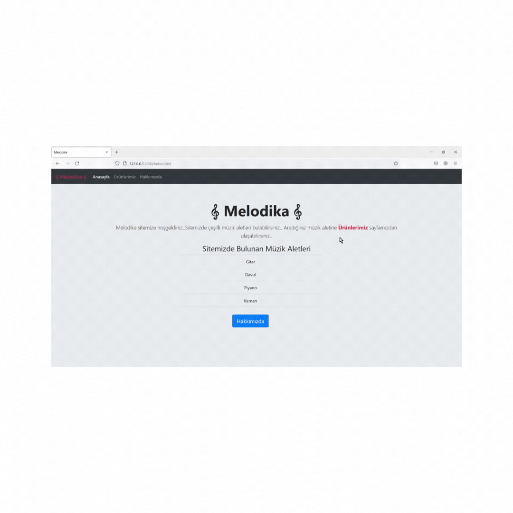

# MusicShop(withBootstrap)


MusicShop(withBootstrap) projemde READEME.md, index.html, hakkimizda.html, urun.html ve img klasörü mevcuttur. img klasöründe projemin urun.html sayfasında kullandığım image dosyaları yer almaktadır.


<hr>



<hr>

# İnstallation

```
https://github.com/reozmen/MusicShop_withBootstrap.git
```


# Published Project

[MusicShop(withBootstrap](https://reozmen.github.io/MusicShop_withBootstrap/)